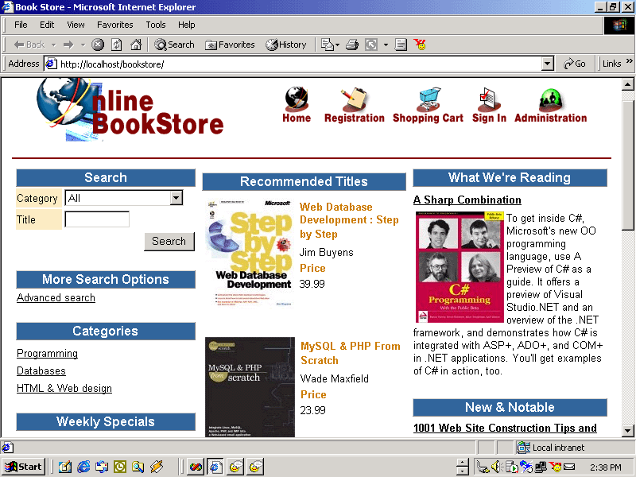



## Book Store portal

### Description

Bookstore portal, its a full program for a portal

for admin, userid: admin password:admin, This portal have is a template create by code charge.

there is a simple way to create a web programming by using code charge. I'm not promote the product but since i've find there's no code same as i've so i just let want to share it with all of u. bye
 
### More Info
 
no input

no need, just need to have a web server

Bookstore portal

there is a simple way to create a web programming by using code charge. I'm not promote the product but since i've find there's no code same as i've so i just let want to share it with all of u. bye

             |
---                |---
**Submitted On**   |2002-03-26 14:37:18
**By**             |[bagoosh](https://github.com/Planet-Source-Code/PSCIndex/blob/master/ByAuthor/bagoosh.md)
**Level**          |Intermediate
**User Rating**    |5.0 (15 globes from 3 users)
**Compatibility**  |ASP \(Active Server Pages\) 
**Category**       |[Complete Applications](https://github.com/Planet-Source-Code/PSCIndex/blob/master/ByCategory/complete-applications__1-27.md)
**World**          |[Visual Basic](https://github.com/Planet-Source-Code/PSCIndex/blob/master/ByWorld/visual-basic.md)
**Archive File**   |[Book\_Store654213262002\.zip](https://github.com/Planet-Source-Code/bagoosh-book-store-portal__1-33069/archive/master.zip)

